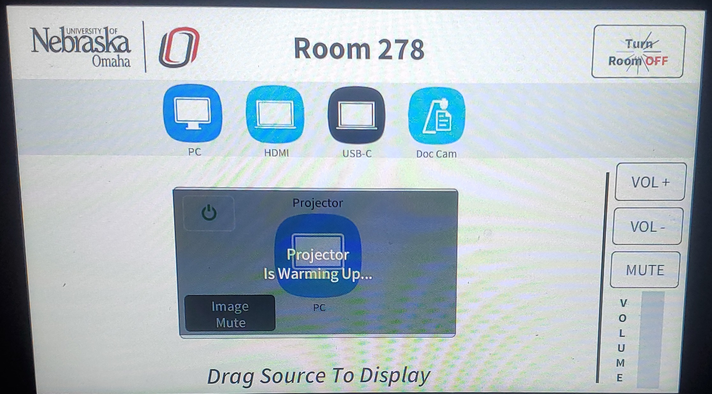

# How to use Zoom and the Cameras in various classrooms

## Need a specific room? Click on the links below to find the room you're looking for!

[Room 279](https://github.com/UNO-IST-Support/Zoom_In_Classrooms#279)
[Room 278](https://github.com/UNO-IST-Support/Zoom_In_Classrooms#278)
[Room 276](https://github.com/UNO-IST-Support/Zoom_In_Classrooms#276)
[Room 269](https://github.com/UNO-IST-Support/Zoom_In_Classrooms#269)
[Room 263](https://github.com/UNO-IST-Support/Zoom_In_Classrooms#263)
[Room 252](https://github.com/UNO-IST-Support/Zoom_In_Classrooms#252)
[Room 155](https://github.com/UNO-IST-Support/Zoom_In_Classrooms#155)

## 279

## Step 1 - Touch the touch panel to turn it on.

## Step 2 - In order for you to display the PC, you will need to drag and drop the PC option to the projectors.

## Step 3 - To start broadcasting to your remote students, please open zoom on the desktop and sign in.

If you don't have any video when you start the zoom meeting, you should be able to select a video option in the bottom left hand corner of the screen. You will need to hit the arrow next to the camera icon. This will bring up a list of options to choose from. Please select "VDO360 2SEE".

Drag on drop a source of your choosing to the projectors.

## To use the DocCam-

## Step 1 - please select share screen at the bottom.

## Step 2 - Please select advanced at the top of the screen.

## Step 3 - Please select, "Content from 2nd Camera" and the doc cam will start displaying in zoom!

Once you are done with the room, please make sure you shut it down. You can do this by clicking the shutdown button in the corner and confirming the shutdown. This will allow the equipment to have a break and let us use it longer.

## 278

## Step 1 - Touch the touch panel to turn it on.

## Step 2 - In order for you to display the PC, you will need to drag and drop the PC option to the projectors.

## Step 3 - To start broadcasting to your remote students, please open zoom on the desktop and sign in.

If you don't have any video when you start the zoom meeting, you should be able to select a video option in the bottom left hand corner of the screen. You will need to hit the arrow next to the camera icon. This will bring up a list of options to choose from. Please select "VDO360 2SEE".

Drag on drop a source of your choosing to the projectors.

## To use the DocCam-

## Step 1 - please select share screen at the bottom.

## Step 2 - Please select advanced at the top of the screen.

## Step 3 - Please select, "Content from 2nd Camera" and the doc cam will start displaying in zoom!

Once you are done with the room, please make sure you shut it down. You can do this by clicking the shutdown button in the corner and confirming the shutdown. This will allow the equipment to have a break and let us use it longer.

## 276

## Step 1 - Touch the touch panel to turn it on.

## Step 2 - In order for you to display the PC, you will need to drag and drop the PC option to the projectors.

## Step 3 - To start broadcasting to your remote students, please open zoom on the desktop and sign in.

If you don't have any video when you start the zoom meeting, you should be able to select a video option in the bottom left hand corner of the screen. You will need to hit the arrow next to the camera icon. This will bring up a list of options to choose from. Please select "VDO360 2SEE".

Drag on drop a source of your choosing to the projectors.

## To use the DocCam-

## Step 1 - please select share screen at the bottom.

## Step 2 - Please select advanced at the top of the screen.

## Step 3 - Please select, "Content from 2nd Camera" and the doc cam will start displaying in zoom!

Once you are done with the room, please make sure you shut it down. You can do this by clicking the shutdown button in the corner and confirming the shutdown. This will allow the equipment to have a break and let us use it longer.

## 269

## Step 1 - Touch the touch panel to turn it on.

## Step 2 - To make the monitor display please drag and drop the pc option to the the projector on the touch panel and the monitor will display.

## Step 3 - Please open zoom on the desktop and sign in.

If no video appears- On the bottom left hand corner of your monitor you will see an option displayed video. Please hit the arrow on the video option on the right. You will see all your video options.
Please make sure video option, " VDO360 2SEE" is selected.

To use display with the projectors please drag and drop what you want to display to the proper projector you wish to display it on.

## To use the DocCam-

## Step 1 - please select share screen at the bottom.

## Step 2 - Please select advanced at the top of the screen.

## Step 3 - Please select, " Content from 2nd Camera" and the doc cam will start displaying in zoom!

## 263

### Step 1 - Select Zoom on the desktop, sign in, and start your zoom meeting.

### Step 2 - Touch the touch panel to turn on the panel and be able to use the room.

### How to use the Touch Panel

The first screen is for the projectors and the doc cam.

To use the projectors, please drag and drop the device you want to project on the projector you would like to use.
The right side box will display on the right, and the left side box will display on the left. Once you have dragged a source onto the projector, please give it some time to warm up and appear on the screens.

During your class, you may need to zoom on the instructor station. You will be able to do this with the rear camera. This camera will also give you 2 other options: screen and wide. Screen will show the board and wide will show a wideshot of the instructor and the board.
There are arrows on the touch panel if you need to move the camera up, down, left, or right.

The front camera is for showing the classroom if you need to show a student standing or have something else to show while not being in front of the board or instructor station.

If you have having audio issues, please make sure echo canceling speaker is selected. You can do this by selecting the carrot arrow by the microphone on the zoom meeting and selecting that option. It should be near the top of the box.

Once you are done with the room, please make sure you shut it down. You can do this by clicking the shutdown button in the upper-left and confirming the shutdown. This will allow the equipment to have a break and let us use it longer.

## 252

### Step 1 - Select Zoom on the desktop, sign in, and start your zoom meeting.

### Step 2 - Touch the touch panel to turn on the panel and be able to use the room.

### How to use the Touch Panel

The first screen is for the projectors and the doc cam.

To use the projectors, please drag and drop the device you want to project on the projector you would like to use.
The right side box will display on the right, and the left side box will display on the left. Once you have dragged a source onto the projector, please give it some time to warm up and appear on the screens.

During your class, you may need to zoom on the instructor station. You will be able to do this with the rear camera. This camera will also give you 2 other options: screen and wide. Screen will show the board and wide will show a wideshot of the instructor and the board.
There are arrows on the touch panel if you need to move the camera up, down, left, or right.

The front camera is for showing the classroom if you need to show a student standing or have something else to show while not being in front of the board or instructor station.

If you have having audio issues, please make sure echo canceling speaker is selected. You can do this by selecting the carrot arrow by the microphone on the zoom meeting and selecting that option. It should be near the top of the box.

Once you are done with the room, please make sure you shut it down. You can do this by clicking the shutdown button in the upper-left and confirming the shutdown. This will allow the equipment to have a break and let us use it longer.

## 158

## 155

### Step 1 - Select Zoom on the desktop, sign in, and start your zoom meeting.

### Step 2 - Touch the touch panel to turn on the panel and be able to use the room.

### How to use the Touch Panel

The first screen is for the projectors and the doc cam.

To use the projectors, please select the device you want to project.
once selected, please give it some time to warm up and appear on the screens.

During your class, you may need to zoom on the instructor station. You will be able to do this with the rear camera. This camera will also give you 2 other options: screen and wide. Screen will show the board and wide will show a wideshot of the instructor and the board.
There are arrows on the touch panel if you need to move the camera up, down, left, or right.

The front camera is for showing the classroom if you need to show a student standing or have something else to show while not being in front of the board or instructor station.

If you have having audio issues, please make sure echo canceling speaker is selected. You can do this by selecting the carrot arrow by the microphone on the zoom meeting and selecting that option. It should be near the top of the box.

Once you are done with the room, please make sure you shut it down. You can do this by clicking the shutdown button in the upper-left and confirming the shutdown. This will allow the equipment to have a break and let us use it longer.

# If you have any other questions or concerns after reading through these instructions, please come find us in PKI241
