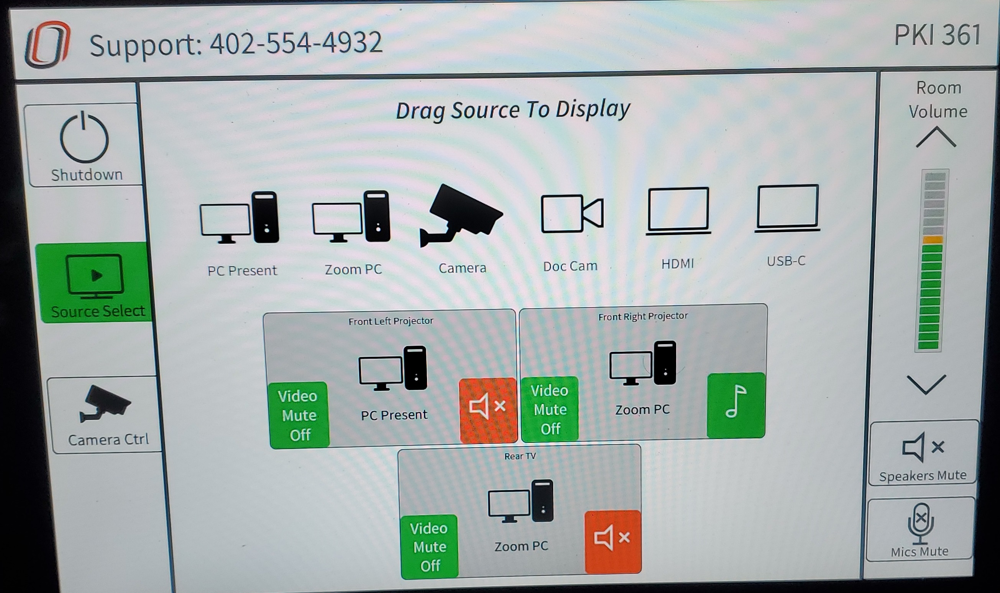
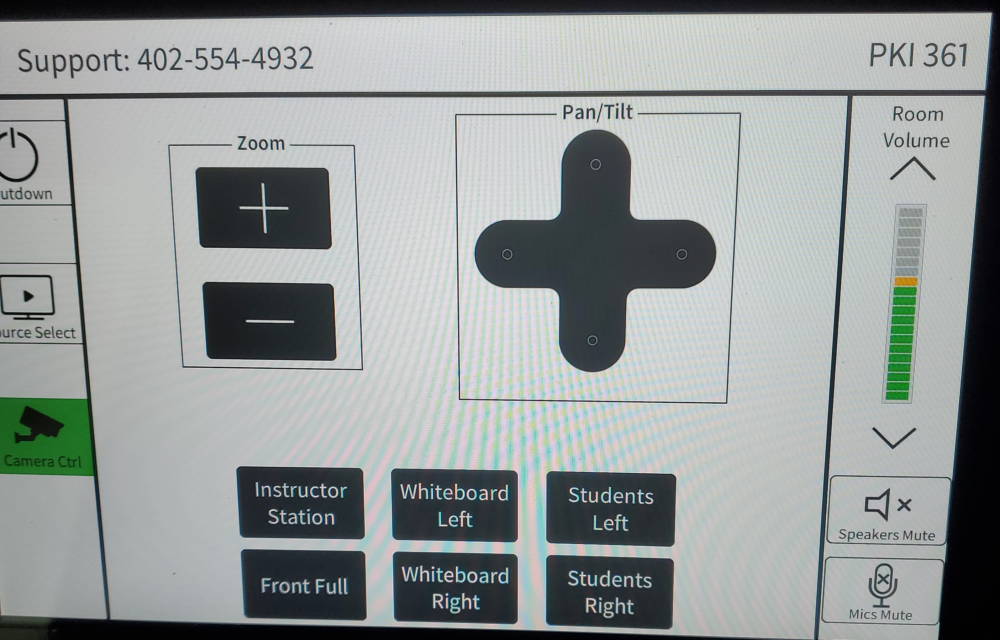
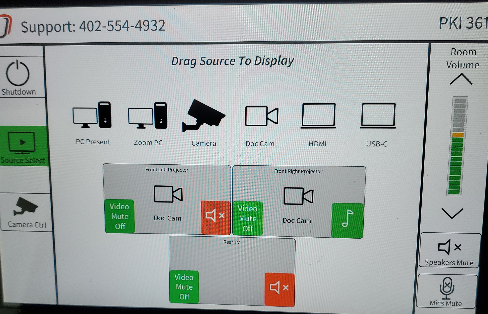
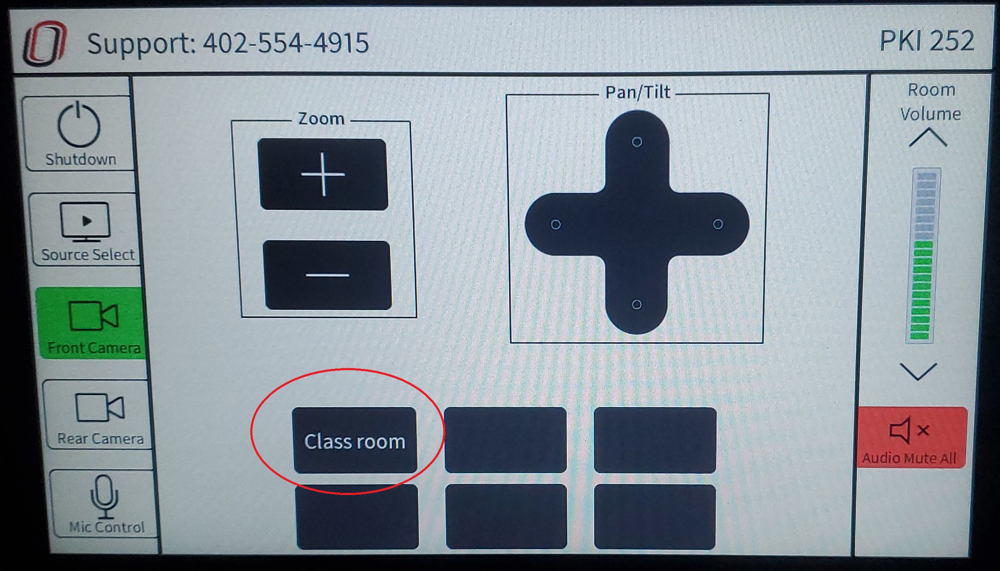
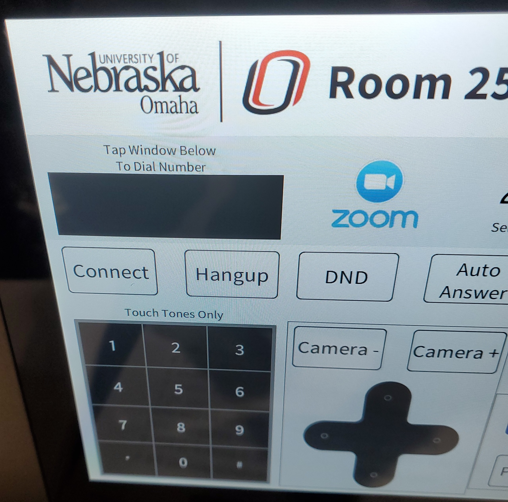
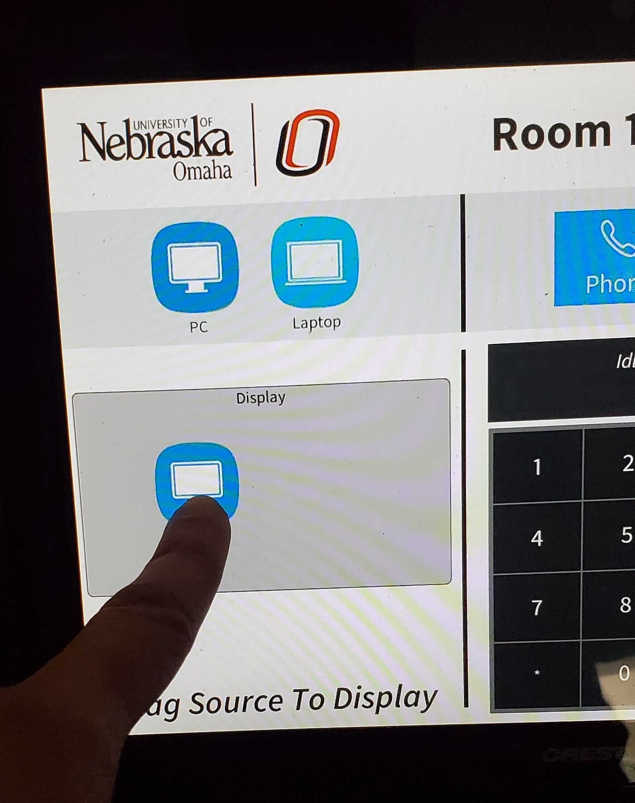
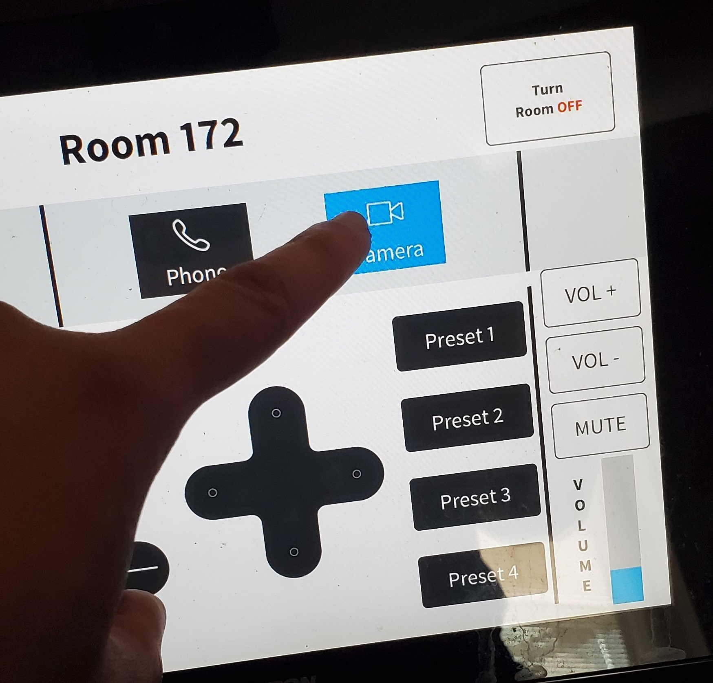

# How to use Zoom and the Cameras in various classrooms

## Need a specific room? Click on the links below to find the room you're looking for!

[Room 391a](https://github.com/UNO-IST-Support/Zoom_In_Classrooms#391a)\
[Room 361](https://github.com/UNO-IST-Support/Zoom_In_Classrooms#361)\
[Room 350](https://github.com/UNO-IST-Support/Zoom_In_Classrooms#350)\
[Room 279](https://github.com/UNO-IST-Support/Zoom_In_Classrooms#279)\
[Room 278](https://github.com/UNO-IST-Support/Zoom_In_Classrooms#278)\
[Room 276](https://github.com/UNO-IST-Support/Zoom_In_Classrooms#276)\
[Room 274](https://github.com/UNO-IST-Support/Zoom_In_Classrooms#274)\
[Room 270](https://github.com/UNO-IST-Support/Zoom_In_Classrooms#270)\
[Room 269](https://github.com/UNO-IST-Support/Zoom_In_Classrooms#269)\
[Room 263](https://github.com/UNO-IST-Support/Zoom_In_Classrooms#263)\
[Room 261](https://github.com/UNO-IST-Support/Zoom_In_Classrooms#261)\
[Room 260](https://github.com/UNO-IST-Support/Zoom_In_Classrooms#260)\
[Room 259](https://github.com/UNO-IST-Support/Zoom_In_Classrooms#259)\
[Room 256](https://github.com/UNO-IST-Support/Zoom_In_Classrooms#256)\
[Room 252](https://github.com/UNO-IST-Support/Zoom_In_Classrooms#252)\
[Room 250](https://github.com/UNO-IST-Support/Zoom_In_Classrooms#250)\
[Room 172a](https://github.com/UNO-IST-Support/Zoom_In_Classrooms#172a)\
[Room 164](https://github.com/UNO-IST-Support/Zoom_In_Classrooms#164)\
[Room 161](https://github.com/UNO-IST-Support/Zoom_In_Classrooms#161)\
[Room 160](https://github.com/UNO-IST-Support/Zoom_In_Classrooms#160)\
[Room 158](https://github.com/UNO-IST-Support/Zoom_In_Classrooms#158)\
[Room 157](https://github.com/UNO-IST-Support/Zoom_In_Classrooms#157)\
[Room 155](https://github.com/UNO-IST-Support/Zoom_In_Classrooms#155)\
[Room 153](https://github.com/UNO-IST-Support/Zoom_In_Classrooms#153)\
[Room 150](https://github.com/UNO-IST-Support/Zoom_In_Classrooms#150)

## 391a

## Step 1 - Verify that the TV and Computer is on. You should see the UNOmaha background of the PC.

## Step 2 - Open Zoom and Sign in like you would for any other zoom session

## Step 3 - Verify that you have audio and video in your meeting and you should be good to go!

 
 
 

## 361

## Step 1 - Touch the touch panel to turn it on.

## Step 2 - In order for you to display the PC, you will need to drag and drop the PC option to the projectors. You can also choose to display Zoom/Doc-Cam/etc.

## Step 3 - To start broadcasting to your remote students, please select the zoom pc option, open zoom on the desktop, and sign in.

If you don't have any video when you start the zoom meeting, you should be able to select a video option in the bottom left hand corner of the screen. You will need to hit the arrow next to the camera icon. This will bring up a list of options to choose from. Please select "VDO360 2SEE".

## NOTE - If you would like to change the camera view, Select "Camera Ctrl" on the left, and you can touch the settings to your needs.

 
 

## To use the DocCam-

## Step 1 - Drag and drop the Doc Cam source onto whichever monitor you would like to display it on. Make sure the light on the doc cam is blue. If it is red, press the power button once and wait. It will start flashing to indicate it is turning on.

Once you are done with the room, please make sure you shut it down. You can do this by clicking the shutdown button in the corner and confirming the shutdown. This will allow the equipment to have a break and let us use it longer.

 
 
 

## 350

## Step 1 - Touch the touch panel and touch the "Projector Power On" button. It should turn green and say "Projector Power Off".

## Step 2 - In order for you to display the PC, you will need to select the PC option.

Once you are done with the room, please make sure you shut it down. You can do this by clicking the shutdown button in the corner and confirming the shutdown. This will allow the equipment to have a break and let us use it longer.

 
 
 

## 279

## Step 1 - Touch the touch panel to turn it on.

## Step 2 - In order for you to display the PC, you will need to drag and drop the PC option to the projectors.

## Step 3 - To start broadcasting to your remote students, please open zoom on the desktop and sign in.

If you don't have any video when you start the zoom meeting, you should be able to select a video option in the bottom left hand corner of the screen. You will need to hit the arrow next to the camera icon. This will bring up a list of options to choose from. Please select "VDO360 2SEE".

Drag on drop a source of your choosing to the projectors.

 
 

## To use the DocCam-

## Step 1 - please select share screen at the bottom.

## Step 2 - Please select advanced at the top of the screen.

## Step 3 - Please select, "Content from 2nd Camera" and the doc cam will start displaying in zoom!

Once you are done with the room, please make sure you shut it down. You can do this by clicking the shutdown button in the corner and confirming the shutdown. This will allow the equipment to have a break and let us use it longer.

 
 
 

## 278

## Step 1 - Touch the touch panel to turn it on.

## Step 2 - In order for you to display the PC, you will need to drag and drop the PC option to the projectors.

## Step 3 - To start broadcasting to your remote students, please open zoom on the desktop and sign in.

If you don't have any video when you start the zoom meeting, you should be able to select a video option in the bottom left hand corner of the screen. You will need to hit the arrow next to the camera icon. This will bring up a list of options to choose from. Please select "VDO360 2SEE".

Drag on drop a source of your choosing to the projectors.

 
 

## To use the DocCam-

## Step 1 - please select share screen at the bottom.

## Step 2 - Please select advanced at the top of the screen.

## Step 3 - Please select, "Content from 2nd Camera" and the doc cam will start displaying in zoom!

Once you are done with the room, please make sure you shut it down. You can do this by clicking the shutdown button in the corner and confirming the shutdown. This will allow the equipment to have a break and let us use it longer.

 
 
 

## 276

## Step 1 - Touch the touch panel to turn it on.

## Step 2 - In order for you to display the PC, you will need to drag and drop the PC option to the projectors.

## Step 3 - To start broadcasting to your remote students, please open zoom on the desktop and sign in.

If you don't have any video when you start the zoom meeting, you should be able to select a video option in the bottom left hand corner of the screen. You will need to hit the arrow next to the camera icon. This will bring up a list of options to choose from. Please select "VDO360 2SEE".

Drag on drop a source of your choosing to the projectors.

 
 

## To use the DocCam-

## Step 1 - please select share screen at the bottom.

## Step 2 - Please select advanced at the top of the screen.

## Step 3 - Please select, "Content from 2nd Camera" and the doc cam will start displaying in zoom!

Once you are done with the room, please make sure you shut it down. You can do this by clicking the shutdown button in the corner and confirming the shutdown. This will allow the equipment to have a break and let us use it longer.

 
 
 

## 274

## Step 1 - Touch the touch panel to turn it on.

## Step 2 - In order for you to display the PC, you will need to drag and drop the PC option to the projectors.

## Step 3 - To start broadcasting to your remote students, please open zoom on the desktop and sign in.

If you don't have any video when you start the zoom meeting, you should be able to select a video option in the bottom left hand corner of the screen. You will need to hit the arrow next to the camera icon. This will bring up a list of options to choose from. Please select "VDO360 2SEE".

Drag on drop a source of your choosing to the projectors.

 
 

## To use the DocCam-

## Step 1 - please select share screen at the bottom.

## Step 2 - Please select advanced at the top of the screen.

## Step 3 - Please select, "Content from 2nd Camera" and the doc cam will start displaying in zoom!

Once you are done with the room, please make sure you shut it down. You can do this by clicking the shutdown button in the corner and confirming the shutdown. This will allow the equipment to have a break and let us use it longer.

 
 
 

## 270

## Step 1 - Touch the touch panel to turn it on.

## Step 2 - In order for you to display the PC, you will need to drag and drop the PC option to the projectors.

## Step 3 - To start broadcasting to your remote students, please open zoom on the desktop and sign in.

If you don't have any video when you start the zoom meeting, you should be able to select a video option in the bottom left hand corner of the screen. You will need to hit the arrow next to the camera icon. This will bring up a list of options to choose from. Please select "VDO360 2SEE".

Drag on drop a source of your choosing to the projectors.

 
 

## To use the DocCam-

## Step 1 - please select share screen at the bottom.

## Step 2 - Please select advanced at the top of the screen.

## Step 3 - Please select, "Content from 2nd Camera" and the doc cam will start displaying in zoom!

Once you are done with the room, please make sure you shut it down. You can do this by clicking the shutdown button in the corner and confirming the shutdown. This will allow the equipment to have a break and let us use it longer.

 
 
 

## 269

## Step 1 - Touch the touch panel to turn it on.

## Step 2 - In order for you to display the PC, you will need to drag and drop the PC option to the projectors.

## Step 3 - To start broadcasting to your remote students, please open zoom on the desktop and sign in.

If you don't have any video when you start the zoom meeting, you should be able to select a video option in the bottom left hand corner of the screen. You will need to hit the arrow next to the camera icon. This will bring up a list of options to choose from. Please select "VDO360 2SEE".

Drag on drop a source of your choosing to the projectors.

 
 

## To use the DocCam-

## Step 1 - please select share screen at the bottom.

## Step 2 - Please select advanced at the top of the screen.

## Step 3 - Please select, "Content from 2nd Camera" and the doc cam will start displaying in zoom!

Once you are done with the room, please make sure you shut it down. You can do this by clicking the shutdown button in the corner and confirming the shutdown. This will allow the equipment to have a break and let us use it longer.

 
 
 

## 263

### Step 1 - Select Zoom on the desktop, sign in, and start your zoom meeting.

### Step 2 - Touch the touch panel to turn on the panel and be able to use the room.

### How to use the Touch Panel

The first screen is for the projectors and the doc cam.

To use the projectors, please drag and drop the device you want to project on the projector you would like to use.
The right side box will display on the right, and the left side box will display on the left. Once you have dragged a source onto the projector, please give it some time to warm up and appear on the screens.

During your class, you may need to zoom on the instructor station. You will be able to do this with the rear camera. This camera will also give you 2 other options: screen and wide. Screen will show the board and wide will show a wideshot of the instructor and the board.
There are arrows on the touch panel if you need to move the camera up, down, left, or right.

The front camera is for showing the classroom if you need to show a student standing or have something else to show while not being in front of the board or instructor station.

If you have having audio issues, please make sure echo canceling speaker is selected. You can do this by selecting the carrot arrow by the microphone on the zoom meeting and selecting that option. It should be near the top of the box.

Once you are done with the room, please make sure you shut it down. You can do this by clicking the shutdown button in the upper-left and confirming the shutdown. This will allow the equipment to have a break and let us use it longer.

 
 
 

## 261

## Step 1 - Touch the touch panel to turn it on.

## Step 2 - In order for you to display the PC, you will need to drag and drop the PC option to the projectors.

## Step 3 - To start broadcasting to your remote students, please open zoom on the desktop and sign in.

If you don't have any video when you start the zoom meeting, you should be able to select a video option in the bottom left hand corner of the screen. You will need to hit the arrow next to the camera icon. This will bring up a list of options to choose from. Please select "VDO360 2SEE".

Drag on drop a source of your choosing to the projectors.

 
 

## To use the DocCam-

## Step 1 - please select share screen at the bottom.

## Step 2 - Please select advanced at the top of the screen.

## Step 3 - Please select, "Content from 2nd Camera" and the doc cam will start displaying in zoom!

Once you are done with the room, please make sure you shut it down. You can do this by clicking the shutdown button in the corner and confirming the shutdown. This will allow the equipment to have a break and let us use it longer.

 
 
 

## 260

## Step 1 - Touch the touch panel to turn it on.

## Step 2 - In order for you to display the PC, you will need to drag and drop the PC option to the projectors.

## Step 3 - To start broadcasting to your remote students, please open zoom on the desktop and sign in.

If you don't have any video when you start the zoom meeting, you should be able to select a video option in the bottom left hand corner of the screen. You will need to hit the arrow next to the camera icon. This will bring up a list of options to choose from. Please select "VDO360 2SEE".

Drag on drop a source of your choosing to the projectors.

 
 

## To use the DocCam-

## Step 1 - please select share screen at the bottom.

## Step 2 - Please select advanced at the top of the screen.

## Step 3 - Please select, "Content from 2nd Camera" and the doc cam will start displaying in zoom!

Once you are done with the room, please make sure you shut it down. You can do this by clicking the shutdown button in the corner and confirming the shutdown. This will allow the equipment to have a break and let us use it longer.

 
 
 

## 259

## Step 1 - If the PC option doesn't have a red light under it, please press it and allow around 25 seconds for the display to warm up. This is the only way for you to get content to be displayed using the PC.

 
 
 

## 256

## Step 1 - Touch the touch panel to turn it on.

## Step 2 - In order for you to display the PC, you will need to drag and drop the PC option to the projectors.

## Step 3 - To start broadcasting to your remote students, please open zoom on the desktop and sign in.

If you don't have any video when you start the zoom meeting, you should be able to select a video option in the bottom left hand corner of the screen. You will need to hit the arrow next to the camera icon. This will bring up a list of options to choose from. Please select "VDO360 2SEE".

Drag on drop a source of your choosing to the projectors.

 
 

## To use the DocCam-

## Step 1 - please select share screen at the bottom.

## Step 2 - Please select advanced at the top of the screen.

## Step 3 - Please select, "Content from 2nd Camera" and the doc cam will start displaying in zoom!

Once you are done with the room, please make sure you shut it down. You can do this by clicking the shutdown button in the corner and confirming the shutdown. This will allow the equipment to have a break and let us use it longer.

 
 
 

## 252

### Step 1 - Select Zoom on the desktop, sign in, and start your zoom meeting.

### Step 2 - Touch the touch panel to turn on the panel and be able to use the room.

### How to use the Touch Panel

The first screen is for the projectors and the doc cam.

To use the projectors, please drag and drop the device you want to project on the projector you would like to use.
The right side box will display on the right, and the left side box will display on the left. Once you have dragged a source onto the projector, please give it some time to warm up and appear on the screens.

During your class, you may need to zoom on the instructor station. You will be able to do this with the rear camera. This camera will also give you 2 other options: screen and wide. Screen will show the board and wide will show a wideshot of the instructor and the board.
There are arrows on the touch panel if you need to move the camera up, down, left, or right.

The front camera is for showing the classroom if you need to show a student standing or have something else to show while not being in front of the board or instructor station.

If you have having audio issues, please make sure echo canceling speaker is selected. You can do this by selecting the carrot arrow by the microphone on the zoom meeting and selecting that option. It should be near the top of the box.

Once you are done with the room, please make sure you shut it down. You can do this by clicking the shutdown button in the upper-left and confirming the shutdown. This will allow the equipment to have a break and let us use it longer.

 
 
 

## 250

## Step 1 - Touch the touch panel to turn it on.

## Step 2 - In order for you to display the PC, you will need to drag and drop the PC option to the projectors.

## Step 3 - To start broadcasting to meeting, select the "Video Conference" option and select Zoom. 

## Step 4 - This will bring up a "Enter Zoom Meeting ID on the TV and the panel will allow for input.

 

## Step 5 - If you want to display something to your meeting, please select "Content Share". All currently active options will have a green dot on them.

## Step 6 - Once your meeting is over, Hang up the call, go back to the main menu and then shut down the system by touching the button in the upper right!

 

 
 
 

## 172a
## Step 1 - Touch the touch panel to turn it on.

## Step 2 - In order for you to display the PC, you will need to drag and drop the PC option to the projectors. If you need to control volume or need to mute, the audio is on the right risde of the panel.

## Step 3A - If you are wanting to do a Zoom Video Conference, you will need to use the PC and double click the zoom icon on the desktop. You can use this to either start a meeting or join one.

 
If you need to adjust the camera, tap on the Camera option, next to the Phone option. This will bring up some controls for you to adjust the camera position as needed.

## Step 3B - If you want to have just an Audio Conference, Tap "Phone", Dial the number, then connect!
-Dial 9 first for outside calls
-Dial 4 followed by the 4 digit extension for University numbers
-Tap Disconnect when done

## Step 4 - Once your meeting is over, Select "End Meeting" on the PC or "Disconnect" if using audio, go back to the main menu, and shut down the system by touching the button in the upper right!

 

 
 
 

## 164

## 161

## 160

## 158

## Step 1 - Touch the touch panel to turn it on.

## Step 2 - Touch the power buttons on the options you wish to activate. Left/Right projectors willl turn on the projectors and bring down screens. Left/Right Display will turn on the monitors to the left and right. Back monitor will power the monitor facing the study rooms. Confidence monitor will power the monitor facing the presenter. Once you have selected the desired displays, press the "Main Page" button on the middle right.

## Step 3 - Select the display or projector you what to put content on, and then choose how you would like to display that content, usually selecting "PC or Laptop".

Once you are done with the room, please make sure to shut it down. You can do this by touching the red power options on the bottom right and selecting shut down. This will allow the equipment to have a break and let us use it longer.

 
 
 

## 157

## Step 1 - Touch the touch panel to turn it on.

## Step 2 - In order for you to display the PC, you will need to drag and drop the PC option to the projectors.

## Step 3 - To start broadcasting to your remote students, please open zoom on the desktop and sign in.

If you don't have any video when you start the zoom meeting, you should be able to select a video option in the bottom left hand corner of the screen. You will need to hit the arrow next to the camera icon. This will bring up a list of options to choose from. Please select "VDO360 2SEE".

Drag on drop a source of your choosing to the projectors.

 
 

## To use the DocCam-

## Step 1 - please select share screen at the bottom.

## Step 2 - Please select advanced at the top of the screen.

## Step 3 - Please select, "Content from 2nd Camera" and the doc cam will start displaying in zoom!

Once you are done with the room, please make sure you shut it down. You can do this by clicking the shutdown button in the corner and confirming the shutdown. This will allow the equipment to have a break and let us use it longer.

 
 
 

## 155

### Step 1 - Select Zoom on the desktop, sign in, and start your zoom meeting.

### Step 2 - Touch the touch panel to turn on the panel and be able to use the room.

### How to use the Touch Panel

The first screen is for the projectors and the doc cam.

To use the projectors, please select the device you want to project.
once selected, please give it some time to warm up and appear on the screens.

During your class, you may need to zoom on the instructor station. You will be able to do this with the rear camera. This camera will also give you 2 other options: screen and wide. Screen will show the board and wide will show a wideshot of the instructor and the board.
There are arrows on the touch panel if you need to move the camera up, down, left, or right.

The front camera is for showing the classroom if you need to show a student standing or have something else to show while not being in front of the board or instructor station.

If you have having audio issues, please make sure echo canceling speaker is selected. You can do this by selecting the carrot arrow by the microphone on the zoom meeting and selecting that option. It should be near the top of the box.

Once you are done with the room, please make sure you shut it down. You can do this by clicking the shutdown button in the upper-left and confirming the shutdown. This will allow the equipment to have a break and let us use it longer.

 
 
 

## 153
### Note: There should be an instruction sheet on the desk in this room as well.

## Step 1 - Tap the Crestron panel to turn it on.

## Step 2 - Select the number of projectors You'd like to use. One or two.

## Step 3 - Select the projector and then pick the source you want to go with that projector. For Example: Projector 1 and touching PC.

 
 

## Using the Doc cam

## Step 1 - Select the projector and touch DOC CAM on the controller. Place your document under the camera. 

## Step 2 - Hold the power button on the Ladibug Doc Cam for 2 seconds.

## Step 3 - Move the camera head and press AUTO TUNE or FOCUS, which should be by the side of the camera head.

Once you are done with the room, please make sure to shut it down. You can do this by touching the red power options on the bottom right and selecting shut down. This will allow the equipment to have a break and let us use it longer. 

 
 
 

## 150

# If you have any other questions or concerns after reading through these instructions, please come find us in PKI241 or create a ticket in the [Issues](https://github.com/UNO-IST-Support/Zoom_In_Classrooms/issues) tab. Thank you.
